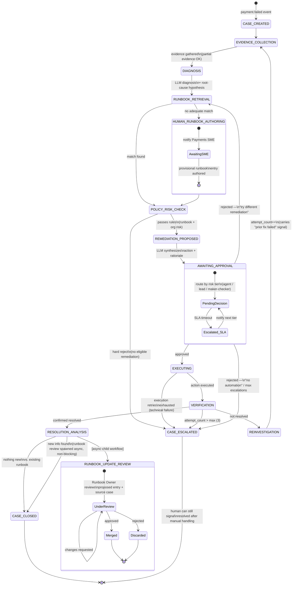

# Payment Failure Remediation Agent — Solution Design

## Context

A payment failed, and today that likely means a human manually digs through logs, guesses a fix, and applies it with no consistent record of what worked. The goal of this project is an agentic system that turns "payment failed" into a governed, auditable case: collect evidence, diagnose (with LLM help), consult a runbook (RAG) for known remediations, check policy/risk, propose an action, require human approval before anything touches real money or systems, execute, and verify the fix actually worked — not just that an API call succeeded. If it didn't work, the system reinvestigates with that new signal, and a human can author or revise a runbook entry live. When a case closes, if it revealed something the runbook didn't already know, that knowledge is proposed back into the runbook (human-reviewed) so the next case benefits.

This is a **personal/from-scratch project** — no existing production system, no real bank data. Every choice below is a fresh recommendation, scoped to what a solo builder can actually run.

### Assumptions

- **Orchestration:** a durable workflow engine (Temporal) governs the case lifecycle as one long-running, resumable workflow per case, with explicit states and signal-based human-in-the-loop wait points. Diagnosis, remediation drafting, and runbook retrieval run as LLM-agent-driven *activities* invoked by that workflow, not as part of the workflow's own deterministic code.
- **Evidence sources:** pluggable connector interface. Initial catalog: payment gateway/processor (Stripe/Adyen-style error codes + txn logs), internal OpenTelemetry-style logs/traces/metrics, customer/account data (payment methods, account status, disputes/fraud flags), prior case history.
- **Remediation actions:** a generic `Action` abstraction with a risk tier (auto-approvable / low / medium / high). Initial catalog spans three tiers: (a) retry/reprocess payment (lower risk), (b) refund/credit/dunning changes (higher risk, maker-checker), (c) feature-flag/gateway-routing/fraud-threshold changes (medium-high risk).
- **Scale target:** built and tested as a single-user, single-machine system. A growth path to enterprise/fintech scale (thousands-millions of failures/day, multi-region, PCI-DSS/SOC2, dedicated SRE) is documented but explicitly not built.
- **Data:** no real bank/payment/customer data is available or will ever be used. All evidence (gateway responses, transaction logs, customer/account records, traces) is synthetic — generated by this project's own **Payment Gateway Simulator**, a first-class component rather than an afterthought. Schemas are modeled after real-world processors (Stripe/Adyen-style error codes and payloads) purely for realism; no external accounts or live API calls are required to build or test the system.

---

## 1. Workflow Diagram

One workflow execution per `Case`. A decoupled child workflow handles runbook curation so knowledge review never blocks case closure.

**Human-in-the-loop gates (3 total):** ad-hoc runbook authoring (novel failure, no match), remediation approval (risk-tiered routing, maker-checker for high risk), and runbook update review (knowledge merge). All three are Temporal signals with SLA timers, not blocking synchronous calls.

---

## 2. System Architecture

| Component | Responsibility |
|---|---|
| **Payment Gateway Simulator** (synthetic data source) | Stands in for a real processor: emits configurable `payment.failed` events with Stripe/Adyen-style error codes, serves fake transaction/customer/account/trace data on query, and lets tests script specific failure scenarios (incl. "still fails after retry") deterministically |
| **Ingestion Layer** | Receives gateway webhooks/internal `payment.failed` events, dedupes, creates `Case`, starts the workflow |
| **Workflow Orchestrator (Temporal)** | Owns durability, retries, timers, signals, versioning of the case lifecycle |
| **Evidence Collector** | Pluggable `Connector` interface (gateway, observability, customer data, case history); runs as activities, fails independently per source |
| **Diagnosis Agent** | Claude activity reasoning over evidence; emits structured `Diagnosis` (schema-validated, not free text) |
| **Runbook/RAG Store** | Vector-indexed runbook corpus + retrieval; ranked candidate matches |
| **Policy/Risk Engine** | Deterministic (non-LLM) rules: spend limits, customer tier, blast radius, compliance holds, runbook-specific constraints; explainable output |
| **Remediation Proposal Generator** | Claude activity combining diagnosis + runbook + policy into a concrete proposal |
| **Action Executor** | Registry of idempotent `Action` adapters, executes only after approval signal |
| **Verification Service** | Re-queries evidence sources post-execution to confirm actual resolution |
| **Approval Service** | Routes by risk tier/role, SLA timers, signals workflow on decision |
| **Audit/Event Log** | Append-only record of every state transition, decision, LLM I/O (PII-redacted), approval |
| **Dashboard/UI** | Case timeline, approval queue with popup decision UI, runbook draft/review editor |

### Data model (key entities)

`Case`, `Evidence`, `Diagnosis`, `RemediationProposal`, `Action`, `Approval`, `RunbookEntry` (provisional/canonical, versioned), `Verification`, `AuditEvent` (append-only, tamper-evident). Evidence stores pointers to a blob store, not inline PII. Every entity is scoped to a `case_id` for tracing.

### Database schema (as built so far)

Only 2 of the 9 entities above have a real Postgres table today — the rest stay as Temporal workflow/activity history until the sprint that gives them a concrete reason to be queried directly from SQL (see Sprint 1 in Section 3). This section is kept in sync with `db/migrations/0001_init.sql`, which is the source of truth for exact column types/constraints.

**`cases`** — one row per case, mirrors the workflow's current state:

| Column | Type | Notes |
|---|---|---|
| `id` | `TEXT` PK | Case id, also used to derive the Temporal workflow id (`case-<id>`) |
| `idempotency_key` | `TEXT` UNIQUE | Dedupes retried/duplicate `payment.failed` webhooks |
| `status` | `TEXT` | Mirrors `CaseStatus` (Section 1's state names); free text, not a Postgres ENUM, so new states don't need a migration |
| `event_payload` | `JSONB` | The raw fake `payment.failed` payload the case was created from |
| `workflow_id` | `TEXT` | Temporal workflow id, for jumping from a DB row to the Temporal UI |
| `attempt_count` | `INTEGER` | `REINVESTIGATION` loop counter; escalates once it exceeds 3 |
| `created_at` / `updated_at` | `TIMESTAMPTZ` | |

**`audit_events`** — append-only log of every state transition (one row per transition, never updated/deleted):

| Column | Type | Notes |
|---|---|---|
| `id` | `BIGSERIAL` PK | |
| `case_id` | `TEXT` FK → `cases.id` | |
| `from_status` | `TEXT`, nullable | `NULL` on the case-created event |
| `to_status` | `TEXT` | |
| `detail` | `JSONB`, nullable | Free-form transition context (e.g. which policy rule fired); no PII by design, matching the "Evidence ... not inline PII" rule above |
| `created_at` | `TIMESTAMPTZ` | |

Indexed on `(case_id, created_at)` so pulling a case's full timeline in order is cheap.

**Not built yet:** `Evidence`, `Diagnosis`, `RemediationProposal`, `Action`, `Approval`, `RunbookEntry`, `Verification` tables. Each gets added in the sprint that first needs to persist it, rather than all 9 up front — a stricter YAGNI call than this doc originally implied, made explicitly during Sprint 1.

---

## 3. Delivery Plan — Sprints & User Stories (2-week sprints)

**Sprint 0 (3-5 days) — Foundations:** Temporal + Postgres via docker-compose; CI with lint/type-check/unit tests.

**Sprint 1 — Walking Skeleton:** entire workflow wired end-to-end with every step stubbed (fixture evidence, fixed diagnosis, hardcoded runbook match, always-approve policy, CLI approval endpoint, no-op executor, always-resolved verification). *Goal: one fake event reaches CASE_CLOSED in <1 min, visible in Temporal UI.*

**Sprint 2 — Payment Gateway Simulator + Real Evidence Collection:** build the synthetic data generator (Payment Gateway Simulator) since no real bank/processor data is available, then build the gateway/customer/case-history connectors against it; each connector fails independently without blocking others (`missing_source` flag). The observability/OTel connector stays a Sprint 1-style stub in Sprint 2 — trace data doesn't change any remediation decision the MVP needs to demonstrate, so real Jaeger integration is deferred rather than built for realism alone.

The simulator classifies decline codes into three internal categories, defined by remediation semantics rather than a full processor glossary — kept to three deliberately, since this is an MVP meant to demonstrate judgment, not model the payments domain exhaustively:

| Category | Example codes | Remediation implication |
|---|---|---|
| `HARD_DECLINE` | `stolen_card`, `fraudulent`, `expired_card` | Never blind-retry. Fraud codes always escalate to a human, no matter the customer; expired-card codes are only fixable via a backup card. |
| `SOFT_DECLINE` | `processing_error`, `try_again_later` | Safe to retry with backoff — the "boring" bucket, included to prove the system doesn't over-engineer every path. |
| `FUNDS_ISSUE` | `insufficient_funds` | Retry-eligible, but *how* to retry depends on customer context — this is the category the demo scenarios below lean on. |

This taxonomy is internal simulator/domain reference data, not something exposed to the diagnosis agent as ground truth — the gateway connector surfaces only the raw `decline_code` a real processor webhook would give; classifying it into a category is Sprint 3's job, not free information from Sprint 2. It exists in Sprint 2 only to keep scenario generation and connector-contract tests consistent.

Customer/case-history evidence gains three proprietary fields — data a real payment processor structurally can't see, but the merchant's own systems can — chosen because each one flips the correct remediation for an otherwise-identical decline code, not for realism alone:
- `customer_tier` (`high_value` | `standard`) — same `insufficient_funds` decline: a standard customer gets full automation, a high-value customer routes to human outreach instead of silent automation.
- `has_backup_payment_method` (bool) — the field that makes an auto-switch-to-backup-card remediation decidable at all; without it that path can't exist.
- `prior_remediation_attempted` (from case history, reusing data the workflow's own `REINVESTIGATION` loop already tracks) — stops the system from proposing an already-failed fix twice.

Gateway evidence also gains `amount`/`currency` — a gap otherwise not closed until Sprint 5's spend-limit checks hit it cold. `Evidence.data` widens from `dict[str, str]` to `dict[str, str | int | float | bool]` to carry these fields natively, without introducing nested per-source structures. No new DB tables are needed for any of this — the simulator stays fixture-based and in-process, since nothing in Sprint 2 needs to query synthetic data directly via SQL.

Three scripted scenarios anchor the sprint's acceptance criteria: the same `insufficient_funds` code for a high-value vs. a standard customer (concierge outreach vs. automated retry); the same code with a backup card on file (auto-switch instead of blind retry); and a `stolen_card` fraud hold (hard stop regardless of customer tier). Together these are enough to prove the system reasons about customer context, not just error codes, without the fixture library becoming its own maintenance burden.

**Sprint 3 — LLM Diagnosis (built and verified 2026-09-22):** Claude-driven diagnosis with schema-validated output, evidence citations, and a golden set for accuracy eval. Replaced `activities/diagnosis_agent.py`'s Sprint 1 stub (which ignored its evidence entirely and always returned a fixed `Diagnosis`) with a real activity that reasons over the `Evidence` Sprint 2 populates.

`Diagnosis` gained a `decline_category: DeclineCategory` field, structured and separate from the narrative `root_cause` — necessary, not optional: Sprint 5's policy engine already has a committed requirement (this doc's own Sprint 5 line) that `HARD_DECLINE`-category codes are a deterministic policy block regardless of LLM confidence, which only works if the category is a real field policy can check. `DeclineCategory` itself moved from `simulator/taxonomy.py` into `models.py` during implementation (not part of the original plan) — building the real activity surfaced a genuine circular import (`models → simulator package → simulator/scenarios.py → models`, still mid-initialization), and the fix also happens to be the architecturally cleaner split: `models.py` now owns the enum (core domain concept `Diagnosis` needs), while `simulator/taxonomy.py` keeps only `category_of`, the decline_code → category answer key, which really is simulator-internal reference data. The diagnosis activity sets `decline_category` via forced tool-use (a `Diagnosis`-shaped schema, `tool_choice` forcing that tool) rather than parsing it out of a chat response, satisfying "schema-validated, not free text" directly — and it imports `DeclineCategory` from `models`, never `category_of` from the simulator, so it cannot cheat by looking up the answer.

Model choice is Sonnet only, as planned — no Haiku cost-split yet. `Diagnosis.confidence` stays purely informational, as planned. The prompt handles a partially-missing evidence list by rendering `UNAVAILABLE (connector failed)` per missing source rather than fabricating data.

The golden set reuses Sprint 2's scenario library, extended from 4 to **9** scenarios (not the 15-20 this line originally cited) — enough for every taxonomy category to have 2-4 real examples (`FUNDS_ISSUE` ×3, `HARD_DECLINE` ×4 across two distinct codes, `SOFT_DECLINE` ×2), without padding the fixture library with near-duplicates just to hit a number. The eval's correctness bar stayed simple as planned: exact `decline_category` match plus non-empty `evidence_cited`.

**Verified against the real Anthropic API, not just schema-checked:** all 9 golden-set scenarios passed (`pytest -m integration`, real `decline_category` match for every scenario). Sample output confirms genuine reasoning, not pattern-matching on customer tier: for `fraud_hold_stolen_card` (a *high-value* customer with a backup card on file), the model's own `root_cause` states *"Customer context (high_value tier, backup payment method on file, no prior remediation attempts) does not change the classification since fraud-flagged instruments must never be auto-retried or remediated regardless of customer value"* — the exact fraud-beats-tier-bias property this taxonomy was designed to prove, stated explicitly by the model, not assumed.

**Operational consequence, resolved (not left open):** the golden-set eval is marked `@pytest.mark.integration` and excluded from CI's existing `pytest -m "not integration"` gate — a marker convention that was already sitting unused in `.github/workflows/ci.yml` since Sprint 0. This means **no `ANTHROPIC_API_KEY` secret or CI workflow change was needed**: CI stays exactly as free/fast/deterministic as before, and the golden-set eval runs on demand (`pytest -m integration`, requires `ANTHROPIC_API_KEY` set locally) rather than on every push.

**One more bug found while wiring this up:** `tests/test_workflow_happy_path.py` and `tests/test_workflow_branches.py` both import the real `diagnosis_agent.diagnose` function directly into their Temporal test-environment worker — once it became a live Claude call, those 9 tests started failing for lack of an API key, even though they're pure workflow-logic tests with no business needing a live LLM. Fixed the same way `persist_case_status`/`append_audit_event` were already faked for the same reason (avoiding a real Postgres dependency): added a `fake_diagnose` activity registered under the same `"diagnose"` name in both test files.

**Sprint 4 — Runbook KB + RAG:** seed 10-15 runbook entries; pgvector similarity retrieval; "no adequate match" threshold routes to human authoring.

**Sprint 5 — Policy/Risk Engine:** spend limits, customer tier, runbook-specific constraints (e.g. max 3 auto-retries); every decision records which rule fired. `HARD_DECLINE`-category codes (Sprint 2) are a deterministic policy block regardless of LLM confidence — a policy invariant, never a runbook suggestion.

**Sprint 6 — Human Approval UX:** web dashboard with a pending-approvals queue and a popup/modal to approve or reject with full case context inline; maker-checker for high risk; SLA escalation timers.

**Sprint 7 — Execution + Verification (Tier A: retry/reprocess):** idempotent retry action against the Payment Gateway Simulator; verification re-checks simulated gateway state (not just "API call succeeded") — a scripted still-failing retry must route to REINVESTIGATION, not CASE_CLOSED.

**Sprint 8 — Expand Action Catalog (Tiers B & C):** refund/credit/dunning (maker-checker), feature-flag/routing/fraud-threshold changes; each adapter unit-testable with mocked side effects.

**Sprint 9 — Reinvestigation/Failure Loop:** not-resolved verification triggers new evidence pass carrying "prior remediation failed" context; ad-hoc runbook authoring mid-case; max-attempt cap (3) force-escalates to human.

**Sprint 10 — Runbook Learning Loop:** resolution analysis detects genuinely-new info vs. existing entry; review UI with source case context; approved entries auto-promote provisional → canonical and re-embed.

**Sprints 11-13 — Enterprise-Pattern Exploration (optional, once the core loop works):** practice for its own sake, not because this deployment needs it — see Section 5.
- **11 — Observability:** local OTel tracing across the full lifecycle incl. LLM calls (latency, token cost); Grafana dashboards for resolution rate, time-to-close, approval turnaround; alerts on stuck cases.
- **12 — Security/audit patterns:** move secrets out of `.env` into a real secrets manager as an exercise; tamper-evident audit log; PII redaction before LLM prompts — good practice even on fake data.
- **13 — Scale/DR patterns:** load-test the compose stack, write a DR runbook as a thought exercise, add LLM cost dashboards/budgets. Kubernetes/Terraform/multi-region are explicitly **not** in scope here — they're the Section 4 growth-path column, only worth building against a real multi-user deployment need.

---

## 4. Tech Stack

This is a solo/personal project with synthetic data — the stack below is scoped to that reality. Everything in the MVP column runs from one `docker-compose.yml` on a laptop. The Growth Path column documents what an actual enterprise deployment would add later; none of it is built now.

| Layer | MVP (build this) | Growth path (defer — enterprise scale only) |
|---|---|---|
| Workflow engine | **Temporal, self-hosted via its official `docker-compose`** | Temporal Cloud (managed, once uptime/SRE burden matters) |
| LLM/agent layer | **Claude (Anthropic API)** — Sonnet for diagnosis/proposals, Haiku for cheap pre-classification; **Claude Agent SDK** for structured tool-use activities | Same — this layer doesn't change with scale, only volume/cost controls do |
| RAG/vector store | **PostgreSQL + pgvector** (same container as primary DB) | Dedicated vector DB (Pinecone/Weaviate) if corpus/query volume grows |
| Backend | **Python + FastAPI**, Temporal Python SDK | Same |
| Primary DB | **PostgreSQL** (one container) | Read replicas/sharding or distributed SQL |
| Event bus | None needed — Temporal's own task queues carry activity dispatch; a simple Postgres table doubles as the audit/outbox log | Kafka or managed queue (SQS/Pub-Sub), only once you have independent consumers/multi-service fan-out |
| Approval UX | **Web dashboard only** (Next.js) — a pending-approvals queue view, and a popup/modal to approve or reject with full case context inline | None needed — no external notification channel required at this scale |
| Frontend | **React + Next.js**, TypeScript | Same |
| Infra | **Docker + docker-compose** — sufficient for a single-user/dev deployment; nothing here needs an orchestrator | Kubernetes + Terraform, only once running multiple replicas across multiple hosts/environments is an actual requirement |
| Secrets | **`.env` file** (git-ignored) — fine, since there are no real credentials, only fake/synthetic ones | A real secrets manager (AWS Secrets Manager/Vault), only once real credentials exist |
| Observability | **OpenTelemetry** SDK, exported to a local **Jaeger + Prometheus + Grafana** stack (also just containers in the same compose file) | Managed SaaS observability (Datadog/Honeycomb), only once a team needs shared dashboards/on-call alerting |

---

## 5. Enterprise-Readiness Checklist

A reference checklist of what a real enterprise deployment would need, kept alongside the design so the gap between "this personal project" and "production system handling real money" is explicit — not a build list for the MVP. Items marked *(MVP)* are worth doing now because they're cheap and shape the data model early; everything else is growth-path.

- **Observability** *(MVP, lightweight version)*: structured logging correlated by `case_id`/`workflow_run_id`; local OTel traces incl. LLM calls via the Jaeger/Prometheus/Grafana containers. *(Growth path: unified SaaS observability, formal SLOs/alerting, on-call.)*
- **Security:** *(Growth path)* real secrets manager, least-privilege per action adapter, immutable/hash-chained audit trail, PII redaction pipeline — not needed while all data is synthetic and running on one machine, but the audit-trail *shape* (`AuditEvent` in Section 2) should exist from day one so it's not a rewrite later.
- **Compliance:** *(Growth path — N/A until real data exists)* PCI-DSS scope minimization, SOC2 readiness. Kept only as a design constraint: never build a code path that assumes raw card data, even with fake data, so the habit transfers if this ever touches real payments.
- **Scalability/HA/DR:** *(Growth path)* multi-region, read replicas/sharding, Kafka fan-out, dedicated SRE, formal DR runbook. A single-node docker-compose has none of this and doesn't need it yet.
- **LLM cost controls:** *(MVP, worth doing early)* Haiku for cheap steps, Sonnet reserved for diagnosis/proposal reasoning; a per-case call cap guards against a runaway loop calling Claude repeatedly.

---

## 6. Testing Strategy

**Isolated/unit:**
- Evidence connectors — cassette-style contract tests per source, backed by the Payment Gateway Simulator's fixtures (no real processor calls ever needed).
- Policy/risk engine — table-driven rule tests incl. boundary cases (exact spend limit, tier edges).
- Action executors — mocked side effects; idempotency-key double-execution checks; parameter validation.
- Runbook retrieval — labeled relevance set with a minimum precision/recall bar.

**Whole-system/integration/e2e:**
- Full Temporal test-environment runs against the Payment Gateway Simulator, exercising every state and both loop-backs.
- Human-approval simulation — automated signal injection (approve/reject/timeout) covering every approval branch incl. SLA escalation.
- Reinvestigation regression tests — fixed scenario where first remediation fails verification, asserting correct second-pass context and eventual escalation at max attempts.
- LLM output evaluation — golden-set testing for diagnosis accuracy and proposal quality, run as a CI gate on every model/prompt change.
- Chaos/failure-injection — kill Temporal workers mid-execution and confirm correct-state resumption; inject connector timeouts; verify idempotent execution under retry.

---

## First Files to Create

- `src/simulator/payment_gateway_simulator.py` — synthetic data generator/fake processor (error codes, txn/customer/trace fixtures, scriptable scenarios); everything else is built and tested against this, never real processor data
- `src/workflows/payment_failure_case_workflow.py` — core Temporal workflow (Section 1 states/transitions)
- `src/workflows/runbook_update_review_workflow.py` — child workflow for KB curation
- `src/activities/evidence_connectors/{base,gateway,observability,customer_data,case_history}.py`
- `src/activities/diagnosis_agent.py`, `src/activities/remediation_proposal_agent.py`
- `src/policy/rules_engine.py`
- `src/actions/{base,retry_payment,issue_refund,toggle_feature_flag}.py`
- `db/migrations/0001_init.sql` — schema for all 9 entities in Section 2

## Verification

- Sprint 1 (walking skeleton) is the first testable milestone: run `docker-compose up`, POST a fake `payment.failed` event, confirm in the Temporal UI and `Case` table that the workflow reaches `CASE_CLOSED` with every state visited.
- From Sprint 2 onward, each sprint's acceptance criteria should be verified by running the relevant unit tests plus a manual/scripted end-to-end case run against the simulator before moving to the next sprint.
- CI gate from Sprint 3 onward includes the LLM golden-set eval so diagnosis/proposal quality regressions block merges, not just functional test failures.
